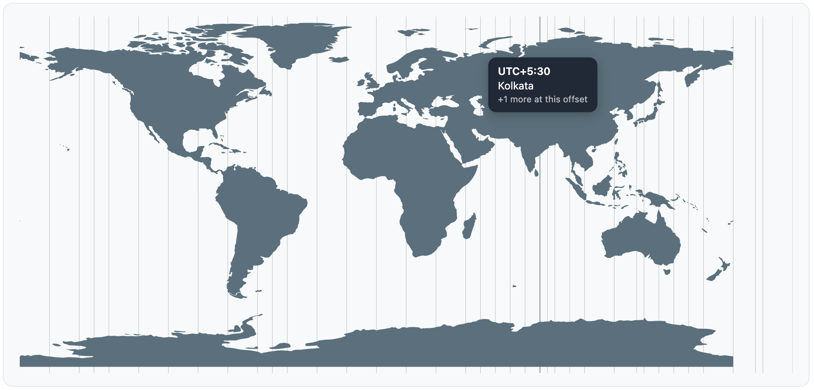

# @mazmoiz/react-timezone-picker-map

An interactive React world map for picking a time zone. Click or tap anywhere on
the map and get back the real IANA time zone at that location — no dropdowns, no
searching through a long list of city names.



## Features

- **Click-to-select world map** — pick a time zone visually, by clicking where a
  location actually is on the map.
- **Complete time zone coverage** — every real-world UTC offset is represented,
  including half-hour and 45-minute offsets (India, Nepal, Chatham Islands, etc.),
  not just whole hours.
- **Accurate nearest-zone detection** — clicking a busy offset line (e.g. UTC-3
  covers ~28 zones) resolves to the specific zone geographically closest to the
  cursor, not just a generic list.
- **Restrict selectable zones** — limit the picker to a specific subset of time
  zones (e.g. only the ones your app supports) via a simple prop.
- **Fully customizable look** — colors for the continents, background, and
  offset lines (including their hover/focus highlight) are all configurable.
- **Responsive by design** — resizes freely with its container without ever
  stretching or distorting the map.
- **Geographically accurate** — built from real world map data, so the time zone
  lines always line up correctly with the landmasses beneath them.
- **TypeScript-first** — full type definitions included, ESM and CJS builds, no
  runtime dependencies beyond `react`/`react-dom`.

## Demo

[](https://stackblitz.com/edit/vitejs-vite-rc9m8ykm?embed=1&file=src%2FApp.tsx)

## Install

```sh
npm install @mazmoiz/react-timezone-picker-map
```

`react` and `react-dom` (`^18` or `^19`) are peer dependencies.

## Usage

```tsx
import { TimeZonePickerMap } from '@mazmoiz/react-timezone-picker-map';

function App() {
  return (
    <div style={{ width: '100%', height: 500 }}>
      <TimeZonePickerMap
        onTimeZoneSelect={(selection) => {
          console.log(selection.label, selection.nearestTimeZone, selection.timeZones);
        }}
      />
    </div>
  );
}
```

### Restricting selectable time zones

```tsx
<TimeZonePickerMap
  enabledTimeZones={['America/New_York', 'Europe/London', 'Asia/Kolkata']}
  onTimeZoneSelect={(selection) => setTimeZone(selection.timeZones[0])}
/>
```

A line is only rendered if at least one enabled zone matches its offset — so the
grid visually trims down to what's actually selectable.

## Props

| Prop                          | Type                                             | Default        | Description                                                              |
| ----------------------------- | ------------------------------------------------ | -------------- | ------------------------------------------------------------------------ |
| `width`                       | `string \| number`                               | `'100%'`       | Width of the map (applied to the root `<svg>`).                          |
| `height`                      | `string \| number`                               | `'100%'`       | Height of the map (applied to the root `<svg>`).                        |
| `className`                   | `string`                                         | —              | Applied to the root `<svg>`.                                             |
| `style`                       | `CSSProperties`                                  | —              | Applied to the root `<svg>`.                                             |
| `continentColor`              | `string`                                         | `'#55717D'`    | Fill color for the continents.                                           |
| `backgroundColor`             | `string`                                         | `'#fff'`       | Fill color for the water/background.                                     |
| `timeZoneLineColor`           | `string`                                         | `'#9AA5B1'`    | Color of the vertical UTC-offset lines.                                  |
| `timeZoneLineHighlightColor`  | `string`                                         | `'#2563EB'`    | Color of a UTC-offset line while hovered or keyboard-focused.            |
| `enabledTimeZones`            | `readonly IanaTimeZoneName[]`                    | all IANA zones | Subset of zones the consumer wants selectable.                           |
| `onTimeZoneSelect`            | `(selection: TimeZoneSelection) => void`         | —              | Fired on click/tap or Enter/Space on a focused line.                     |
| `onTimeZoneHover`             | `(selection: TimeZoneSelection \| null) => void` | —              | Fired on hover/focus (`selection`) and on leave/blur (`null`).           |

`TimeZoneSelection` shape:

```ts
interface TimeZoneSelection {
  offsetMinutes: number; // e.g. 330 for UTC+5:30
  label: string; // "UTC-12" .. "UTC+14", e.g. "UTC+5:30", "UTC+12:45"
  timeZones: readonly string[]; // enabled IANA zones whose standard offset is this
  nearestTimeZone: string | null; // whichever of timeZones is geographically closest
  // to the exact hover/click position; null for keyboard activation (no cursor
  // position) or if none of timeZones has a known coordinate.
}
```

## Good to know

- **Zones are grouped by their standard (non-DST) offset**, so a zone always sits
  at its true geographic position year-round — it doesn't jump lines when
  daylight saving time shifts its current offset.
- **A few zones (Chatham Islands, Tonga, Samoa, Kiribati) sit beyond UTC+12** and
  are shown in a small extended strip past the map's right edge.
- The map resizes freely with its container without ever stretching or distorting
  — extra space is simply left blank rather than warping the continents.

## License

MIT
